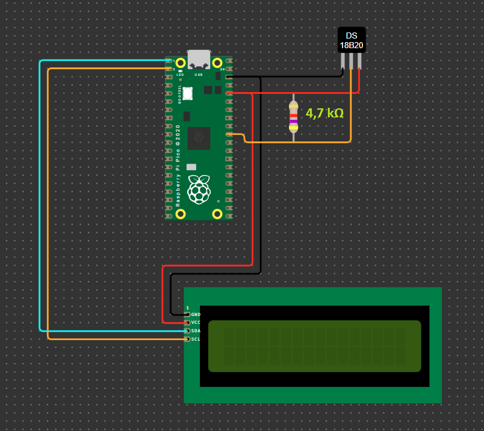
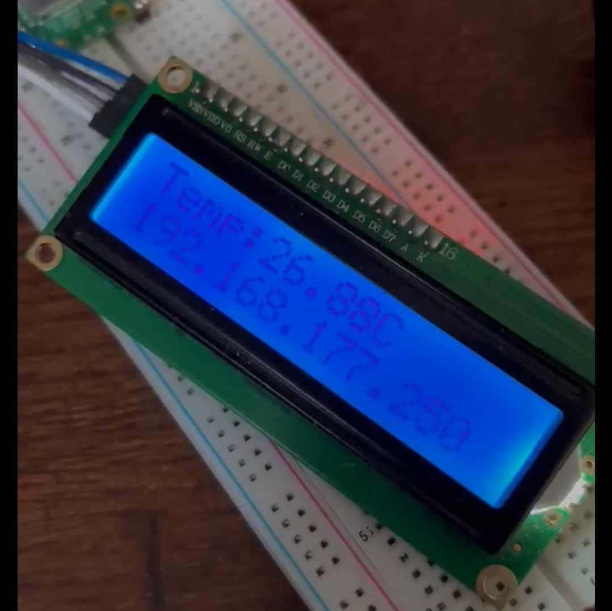
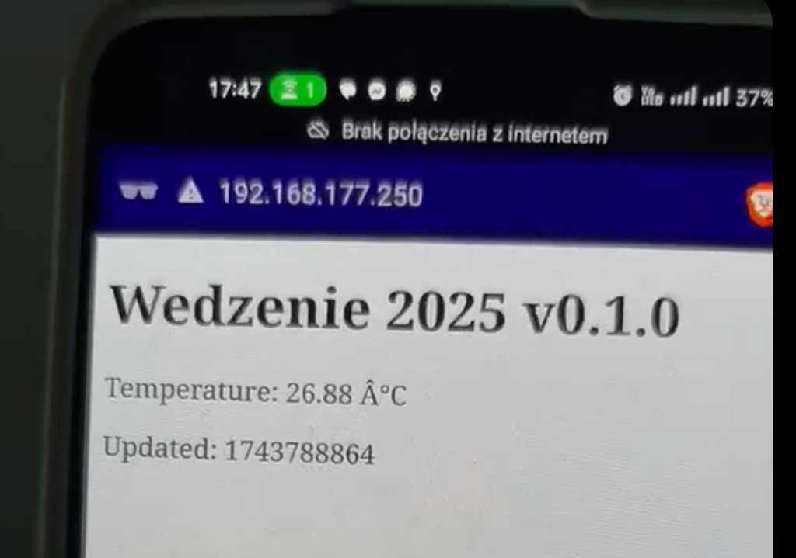

# Raspberry Pi Pico W Thermometer Project

## Overview
This project uses a Raspberry Pi Pico W to create a thermometer system that measures temperature using a DS18B20 sensor, displays the data on an I2C LCD screen, and serves the temperature readings via a web interface. The system also connects to Wi-Fi for remote monitoring.

## Features
- **Temperature Measurement**: Utilizes the DS18B20 sensor for accurate temperature readings.
- **LCD Display**: Displays real-time temperature and IP address on a 16x2 I2C LCD.
- **Web Server**: Hosts a simple webpage showing the current temperature and updates every 5 seconds.
- **Wi-Fi Connectivity**: Connects to a specified Wi-Fi network for remote access.
- **Error Handling**: Displays error messages on the LCD in case of issues.

## Hardware Requirements
- Raspberry Pi Pico W
- DS18B20 (Okystar) temperature sensor
- I2C LCD (16x2)
- Resistor 4,7 kΩ between 3V and thermometer signal wire. - depends on your DS18B20 model (pls confirm with the docs)
- Breadboard or PCB for assembly

## Software Requirements
- MicroPython installed on Raspberry Pi Pico W
- Required libraries:
  - `machine`
  - `network`
  - `socket`
  - `time`
  - `onewire`
  - `ds18x20`

## Configuration
Update the following variables in the code:
- **Wi-Fi Credentials**:
```python
  WIFI_SSID = "Your_SSID"

  WIFI_PASSWORD = "Your_Password"
```

- **Pins and Settings**:
```python
  I2C_SDA_PIN = 0 #SDA Wire for LCD

  I2C_SCL_PIN = 1 #SCL Wire for LCD

  DS_PIN = 26 # Signal from thermometer (Remember to connect this circut with 3V by Resistor 4,7 kΩ )
```

3v3 V Pico pin is suitable to porwer all devices in this circut.

You can simply power LCD and thermometer without additional electronic components.

When the device is connected to network, it's IP address is shown on the LCD screen

You need to start: http://{ip} in browser incognito mode to avoid storing cache:





## Power Management

Device is powered by standard Pico USB - you can use powerbank for example

There is no problem to power the device by Pico VSYS pin with 5V but make sure that devices in circut uses 3V energy.
